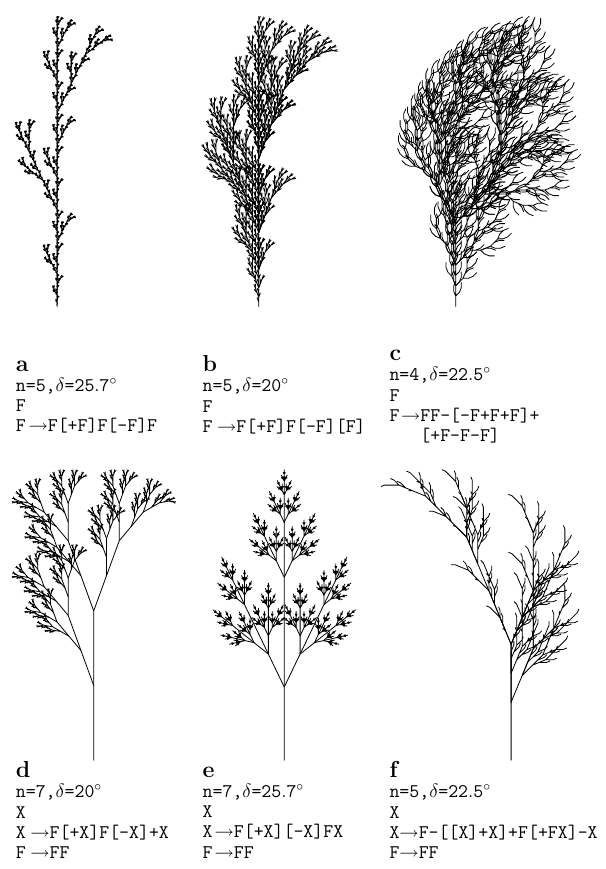

# Növények, nyelvek, gépek és hódok

Salvi Péter, 2021

Ebben a dokumentumban megpróbáltam összeszedni néhány (szerintem) izgalmas témát a formális nyelvek és automaták területéről, az ezzel általában együtt járó technikai jelölések mellőzésével.

## Generatív nyelvtanok

Bizonyos növények fejlődését modellezni lehet egy *nyelvtan* segítségével, ami egy kezdeti "rügyből" kiindulva azt lépésenként növeszti, amíg el nem éri végső állapotát. Az alkotóelemeket egy ábécé betűivel jelölhetjük, a lépéseink pedig mindig abból állnak, hogy egy vagy több szimbólumot adott szabályok szerint másokra cserélünk.

Egy ilyen rendszert *generatív nyelvtannak* neveznek, és az általa képezhető szavak összessége pedig a nyelvtan által generált nyelv. Az ábécében levő szimbólumokat két csoportra osztjuk, *terminálisokra* és *nemterminálisokra*; ez utóbbiba tartozik a kezdő szimbólum is.

Nézzünk egy példát! Legyen `n` a kezdő (nemterminális) szimbólum, `0` és `1` pedig a terminálisok. A szabályok legyenek a következők:
```
1. n -> 0n0
2. n -> 1n1
3. n -> 0
4. n -> 1
5. n -> ∅
```
Ezek alapján például le tudjuk generálni az `11011011` szót:
```
n --2-> 1n1 --2-> 11n11 --1-> 110n011 --2-> 1101n1011 --5-> 11011011
```
Az utolsó lépésben az `n` eltűnik, és innentől már nincs több alkalmazható szabály. Könnyen látható, hogy ezekkel a szabályokkal az összes `0` és `1` számokból álló palindróma (oda-vissza ugyanolyan szó) írható le.

A szabályokra különféle megkötéseket lehet tenni, amelyek segítségével a generált nyelveknek egy hierarchiáját építhetjük fel.

### Reguláris (3. típusú) nyelvek

A szabályok két fajtája megengedett:
```
1. x -> yX
2. x -> X
```
Itt `x` és `y` nemterminális szimbólumok, `X` pedig terminálisok (akár üres) sorozata. Például ha a fenti példában szereplő szimbólumokhoz még hozzátesszük a nemterminális `a`-t, az
```
1. n -> a01
2. a -> a001
3. a -> 01
```
szabályok segítségével legenerálhatóak a `0101`, `0100101`, `0100100101`, .., `01(001)*01` szavak, ahol a csillag a zárójeles kifejezés tetszőleges számú ismétlését jelzi, pl.:
```
n --1-> a01 --2-> a00101 --2-> a00100101 --3-> 0100100101
```

### Környezetfüggetlen (2. típusú) nyelvek

Legyen minden szabály `x -> X` alakú, ahol `x` nemterminális szimbólum, `X` pedig tetszőleges szó, tehát vegyesen lehetnek benne terminálisok és nemterminálisok (`X` lehet üres is). Ez nyilván a szabályoknak egy tágabb halmaza; a fenti palindrómás példa is ide tartozik.

### Környezetfüggő (1. típusú) nyelvek

Legyen minden szabály `XyZ -> XYZ` alakú, ahol `y` nemterminális szimbólum, `X`, `Y` és `Z` pedig tetszőleges szó. `X` és `Z` lehet üres is, viszont `Y` csak akkor, ha `X` és `Z` is az (tehát ha a szabály `y -> ∅` alakú), és `y` nem szerepel egy szabály jobboldalán sem.

### Rekurzívan felsorolható (0. típusú) nyelvek

Ez a nyelvek legtágabb osztálya: a szabályokra nincsenek megkötések, tetszőleges két szó közti átmenet megengedett.

### Lindenmayer-rendszerek

Visszatérve a növények modellezésére, a Lindenmayer- vagy L-rendszerek olyan környezetfüggetlen nyelvtanok, amelyeknek a szabályai közt nincs két azonos baloldalú. A generálás folyamata kissé eltér a fent leírttól: minden egyes iterációban az összes szabályt egyszerre, minden lehetséges helyen alkalmazzuk. Például az eredeti, algák növekedésére készített rendszer
```
a -> ab
b -> a
```
volt, ahol `a` a kezdő szimbólum. Az iterációk során tehát így változik:
```
0. a
1. ab
2. aba
3. abaab
4. abaababa
5. abaababaabaab
6. abaababaabaababaababa
...
```

Ezt a logikát egyszerű grafikai értelmezéssel kombinálva nagyon szép fraktálokat, páfrányokat és fákat lehet generálni. A Sierpiński-háromszög készítéséhez pl. a következő szabályok alkalmazhatóak:
```
a -> f-g-g
f -> f-g+f+g-f
g -> gg
```
Jelentse itt az `f` és `g` egyaránt azt, hogy az aktuális irányban egységnyi vonalat húzunk, a `-` és `+` pedig hogy jobbra ill. balra fordulunk 120 fokot.

Az alábbi Prolog program kiszámolja az *n*-edik iteráció eredményét, és kiírja a megfelelő Logo programot:
```prolog
lindenmayer(0, X) :- prologue, maplist(paint, X).
lindenmayer(N, X) :- N > 0, N1 is N - 1, iterate(X, X1), lindenmayer(N1, X1).

iterate([], []).
iterate([X|Xs], Z) :- rule(X, Y), iterate(Xs, Ys), append(Y, Ys, Z).
iterate([X|Xs], Z) :- \+ rule(X, _), iterate(Xs, Ys), append([X], Ys, Z).

prologue :-
    write('clearscreen'), nl,
    write('make "size 10'), nl,
    write('make "angle 120'), nl.

paint(f) :- write('forward :size'), nl.
paint(g) :- write('forward :size'), nl.
paint(-) :- write('right :angle'), nl.
paint(+) :- write('left :angle'), nl.

rule(a, [f,-,g,-,g]).
rule(f, [f,-,g,+,f,+,g,-,f]).
rule(g, [g,g]).
```
Példa a program kimenetére:
```
?- lindenmayer(2, [a]).
clearscreen
make "size 10
make "angle 120
forward :size
right :angle
forward :size
left :angle
forward :size
left :angle
forward :size
right :angle
forward :size
right :angle
forward :size
forward :size
right :angle
forward :size
forward :size
```
7-8 iteráció után már elég szép ábrát kapunk.

### Feladatok



1. Rekonstruáld ezeket a növényeket a fenti Prolog program segítségével! Segítség: a `[` és `]` rendre a rajzolási állapot (pozíció, irány) verembe mentését és onnan visszatöltését jelentik; Logoban ezeknek a `push "s pos push "s heading` ill. `penup setheading pop "s setpos pop "s pendown` parancssorozatok felelnek meg, ahol `s` egy kezdetben üres lista, amit a `make "s []` paranccsal készíthetünk el. Az `X`-nek a rajzolásban nincsen szerepe.
2. Írd át a programot, hogy ne Logo, hanem PostScript programot generáljon!
3. Írd újra a programot PostScriptben, más programnyelv használata nélkül!

## Automaták

Egy nagyon izgalmas eredmény, hogy a fent bemutatott ún. Chomsky-hierarchia egyes nyelvosztályaihoz tartozik egy-egy *állapotgép*, ami a nyelv által generált szavakat ismeri fel.

### Véges automata

A legegyszerűbb ilyen gép a *véges automata*. Ezt úgy lehet elképzelni, mint egy dobozt, amibe be tudunk dugni egy szalagot, amin szimbólumok sorozata van, és a gép ezt balról jobbra tudja olvasni. A gépen van ezenkívül egy lámpa, ami kijelzi, hogy a gép elfogadta-e (felismerte-e) a szalagon levő szót.

A gép véges sok állapotban lehet, ezek közül egy kitüntetett állapot a kezdőállapot, és lehet egy vagy több végállapota. Ha a szó végigolvasásakor végállapotba kerül, a szót elfogadja, egyébként nem. A gép működését *állapotátmenetek* határozzák meg, amelyek mindig az aktuális állapottól, és az olvasó fej által éppen érzékelt szimbólumtól függnek. A gép determinisztikus, tehát egy adott állapotban egy bizonyos szimbólumra csak egy állapotátmenetet engedünk meg.

Ez a gép reguláris kifejezéseket képes felismerni, tehát olyan szavakat, amelyeknek részeit iterálhatjuk (`*`) vagy választhatunk közülük (`+`), pl. van olyan véges automata, ami a `0(01+110)*1` nyelvet ismeri fel, így pl. a `01`, `0011`, `01101`, `001011`, `0011101` stb. szavakat. Az automata így néz ki:
```
          +---<---+----<----+
          |       |         |
          |       1         |
          v       |         0
[A] --0-> B --0-> C         |
          |                 |
          +---1-> (D) --1-> E
```
Itt az `[A]` a kezdő-, és a `(D)` a végállapot.

Könnyen belátható, hogy a véges automaták és a reguláris generatív nyelvtanok kölcsönösen megfeleltethetőek egymásnak.

Egy érdekes tétel a "pumpa-lemma". Ez azt mondja ki, hogy egy *n* állapotból álló véges automatánál minden legalább *n* hosszú `W` szó felosztható `W = XYZ` alakban úgy, hogy `XY` hossza legfejlebb `n`, `Y` nem üres, és az `Y` többszöri alkalmazásával kapott `XYYZ`, `XYYYZ` stb. szavak szintén benne vannak a nyelvben. Az alapgondolat az, hogy ha egy szó legalább *n* hosszú, akkor az elfogadásakor át kell, hogy menjen egy hurkon, és a hurok tetszőlegesen ismételhető.

A fenti példában 5 állapot van (`A`-`E`), tehát ha veszünk egy legalább 5 hosszú szót a generált nyelvből, pl. a `01101`-et, ez garantáltan átmegy egy hurkon - és tényleg, a `B-D-E` hurkon. Ha tehát `X = 0`, `Y = 110`, `Z = 1`-et választunk, az `XYY..Z` tényleg benne lesz a nyelvben.

Ebből következik, hogy pl. a palindrómák felismerésére a véges automaták nem alkalmasak. Vegyük azt az `a..aba..a` alakú palindrómát, aminek az elején és végén is *n* darab `a` áll. Ez tehát hosszabb, mint *n*, következésképp kéne, hogy létezzen a fent leírt felbontás. Viszont `XY` hossza legfeljebb *n* lehet, tehát csak `a`-kból állhat, így `Y` ismétlése után csak a kezdő `a`-k száma fog nőni, és nem lesz többé palindróma, ellentmondásra jutottunk.

### Veremautomata

Az előbbi gépünkhöz adjunk hozzá egy újabb szalagot, ami kezdetben üres, és az egyik irányban végtelen. Ezen a szalagon a gép két műveletet tud végezni:

1. `push`: jobbra mozgatja, és ráír egy szimbólumot
2. `pop`: törli az aktuális szimbólumot, és balra mozgatja

Az állapotátmenetek a két szalagon látott szimbólumok alapján történnek, és lehetnek nemdeterminisztikusak is, tehát azonos állapot+szimbólumpárhoz több átmenet is tartozhat, de egy adott szó felismerésekor a gépről feltételezzük, hogy mindig a "megfelelő" lehetőséget választja.

A gép a nevét arról kapta, hogy a plusz szalag felfogható úgy, mint egy verem, ahova felülről be tudunk dobni újabb és újabb szimbólumokat (`push`), amelyekből mindig csak a legfelső látszik, majd ha már nem kell, a legfelsőt kidobjuk (`pop`), és ezáltal az alatta levő láthatóvá válik.

Bizonyítható, hogy az egy ilyen gép által felismerhető nyelvek éppen a környezetfüggetlenek lesznek.

#### Feladatok

1. Egy nyelv tartalmazza az `a..b..` szavakat, ahol az `a`-k és `b`-k száma azonos. Mutasd meg, hogy ezt véges automatával nem lehet leírni, és írj veremautomatát, ami csak ennek a nyelvnek a szavait fogadja el!

2. Egy nyelv tartalmazza a `0..1..0..1..` alakú szavakat, ahol vagy a két `0`-s csoport, vagy a két `1`-es csoport hossza azonos, tehát ide tartozik a `000110001` és a `0110011` is. Írd le ezt a nyelvet nemdeterminisztikus veremautomatával!

### Lineárisan korlátolt automata

Itt most megint csak egy szalagunk van, de az hosszú, jobbra-balra mozgatható, és írni is lehet rá. (A szalagon elhelyezett vizsgált szót speciális szimbólumokkal határoljuk el.) Annyi megkötés van még, hogy a szalag hossza a bemeneti szó hosszának legfeljebb csak valamilyen fix *k*-szorosa lehet.

Egy állapotátmenet itt már nem csak azt mondja meg, hogy adott állapotban ha egy bizonyos szimbólumot látunk, akkor milyen állapotba váltsunk, hanem azt is, hogy a látott szimbólum helyére mit írjunk, és a szalagot melyik irányba mozgassuk, pl.:
```
start/1 => next/0, right.
```
Tehát a `start` állapotban ha `1`-est látunk, akkor a `next` állapotba váltunk, `0`-t írunk, és a szalagot jobbra mozgatjuk.

Ha megengedünk nemdeterminisztikus átmeneteket, ez a gép pontosan a környezetfüggő nyelvtanoknak felel meg. Az viszont még nem ismert, hogy minden környezetfüggő nyelvtan leírható-e a determinisztikus variánssal.

#### Feladat

Egy nyelv tartalmazza az `a..b..c..` szavakat, ahol az `a`-k, `b`-k és `c`-k száma azonos. Mutasd meg, hogy ezt veremautomatával nem lehet leírni, és írj lineárisan korlátolt automatát, ami pontosan ennek a nyelvnek a szavait fogadja el!

### Turing-gép


Végül a Turing-gépnél feloldjuk a lineáris korlátot is, és azt mondjuk, hogy a szalag legyen végtelen hosszú. Létezik nemdeterminisztikus és/vagy többszalagos változata, de ezek is ugyanazokat a nyelveket képesek felismerni - a rekurzívan felsorolhatóakat. (Sőt, a szalag elég, ha az egyik irányban végtelen.)

A Turing-gépek használhatóak függvények kiszámítására is: a szalagon kezdetben adottak a függvény paraméterei, és a gép leállásakor a szalagon található az eredmény (konvenció szerint az olvasófejtől balra). 

A számításelmélet talán legfontosabb tétele a Church-Turing tézis, miszerint a Turing-gépek, a rekurzív függvények, a lambda-kalkulus, és a számítógépes (nem interaktív) programok mind azonos "erősségűek", ugyanazokra a számításokra képesek.

Ennek egy következménye, hogy ha egy programozási nyelvben lehet szimulálni egy Turing-gép működését, akkor (számításelméleti szempontból) éppen olyan jó, mint bármely másik nyelv. Természetesen ettől egy programnyelv még nem lesz kényelmesen használható - erre utal a "Turing-kátránygödör" (*Turing tar-pit*) kifejezés, amibe olyan nyelvek tartoznak, mint a Brainfuck, a Whitespace vagy az Unlambda (ez utóbbi lambda-kalkulust valósít meg, úgyhogy a Church-Turing tézis közvetlenül alkalmazható).

### Turing-gép Prologban

Írjunk Turing-gépet Prologban! Ahogy általában a Turing-gép, mint programozási nyelv tárgyalásánál szokás, a szalagra írható szimbólumok legyenek a `0` és az `1`.

Programozási szempontból a végtelen szalag reprezentációja egy érdekes kérdés. Tároljuk külön az olvasófejtől balra és jobbra levő részt, méghozzá a baloldalit megfordítva! A szalag tehát `Left-[X|Right]` alakú lesz, ahol `Left` a balra levő szimbólumok listája (a lista feje a közvetlenül balra levő szimbólum), `X` az olvasófej alatti szimbólum, `Right` pedig a jobbra levő szimbólumok listája. Ugyan ez még mindig véges, de tudjuk szimulálni a végtelenséget: szükség esetén `0`-kkal egészítjük ki. A balra és jobbra mozgatás szabálya tehát:

```prolog
move([]-B, left, []-[0|B]).
move([X|A]-B, left, A-[X|B]).
move(A-[X], right, [X|A]-[0]).
move(A-[X,Y|B], right, [X|A]-[Y|B]).
```

A szabályokat az `=>` operátor segítségével adjuk meg úgy, ahogy a lineárisan korlátolt automatáknál láttuk.

```prolog
:- op(1100, xfx, =>).
```

A gép "futtatása" ezután már könnyen megfogalmazható:

```prolog
run(Tape, stop, Tape).
run(Left-[X|Right], State, Result) :-
    write_state(Left, X, Right, State),
    (State/X => State1/Y, Movement),
    move(Left-[Y|Right], Movement, Tape),
    run(Tape, State1, Result).
```

A `stop` a végállapot; a `write_state` kiírja minden lépés után az aktuális állapotot és a szalag tartalmát, és megmutatja a fej pozícióját:

```prolog
write_state(Left, X, Right, State) :-
    reverse(Left, Left1), append(Left1, [X|Right], Tape),
    write(Tape), tab(3), write(State), nl,
    length(Left, N), N1 is N * 2 + 1,
    tab(N1), write('^'), nl.
```

Végül a legfelső szinten csak a szalagot adjuk meg, és visszakapjuk a (fejtől balra levő) eredményt:

```prolog
turing(Tape, Result) :- run([]-Tape, start, Left-_), reverse(Left, Result).
```
(A `start` a kezdőállapot.)

Példaként itt egy program, ami összead két számot. A számok unárisan vannak megadva (annyi darab `1`-es, amennyi a szám értéke), és egy `0`-val vannak elválasztva. A program annyit csinál, hogy a köztük levő `0`-t `1`-re cseréli, és utána a második szám végére érve az utolsó `1`-est `0`-ra cseréli.

```prolog
start/0 => next/1, right.  % megkeressük a két szám közti `0`-t,
start/1 => start/1, right. %   és `1`-re cseréljük
next/0 => dec/0, left.     % megkeressük a második szám végét
next/1 => next/1, right.
dec/1 => stop/0, right.    % az utolsó `1`-est `0`-ra cseréljük
```

Például 2 + 3 kiszámítása:
```
?- turing([1,1,0,1,1,1], X).
[1,1,0,1,1,1]   start
 ^
[1,1,0,1,1,1]   start
   ^
[1,1,0,1,1,1]   start
     ^
[1,1,1,1,1,1]   next
       ^
[1,1,1,1,1,1]   next
         ^
[1,1,1,1,1,1]   next
           ^
[1,1,1,1,1,1,0]   next
             ^
[1,1,1,1,1,1,0]   dec
           ^
X = [1, 1, 1, 1, 1, 0] 
```

### Univerzális Turing-gép

Lehet készíteni *univerzális Turing-gépet* is, ami egy Turing-gép specifikációja és egy bemeneti szalag alapján kiszámolja, hogy a megadott Turing-gép a megadott adatra mit adna.

De mit jelent az, hogy egy Turing-gép *specifikációja*? Ezt úgy kell elképzelni, hogy a Turing-gép programját egy számmá alakítjuk valamilyen megadott módon. Az egyes állapotokat számokkal jelölhetjük - a `start` lehet az 1-es, a `stop` a 0-s, a többi pedig 2-től felfele. Minden állapothoz felsoroljuk, hogy mit csinál `0`-ra és mit `1`-re. Ekkor a fenti összeadó program így néz ki:

```
21R11R30L21R00R00R
```

Ebből az első `21R` azt jelenti, hogy (1-es állapotban olvasott `0` esetén) a 2-es állapotba kell menni, `1`-et kell írni, és utána jobbra kell mozgatni a szalagot; a következő `11R` jelentése az, hogy (1-es állapotban olvasott `1` esetén) 1-es állapotban maradunk és `1`-est hagyunk a szalagon, majd azt jobbra mozgatjuk stb. Mivel a `dec` (3-as) állapothoz nem volt definiálva, mit csináljon `0` esetén, azt is `00R`-el (tehát `stop/0, right`-al) töltöttük ki.

Most már csak annyi van hátra hogy ezt át kell váltani `0`-k és `1`-esek sorozatára. Ehhez a számokat unárisba váltjuk, majd ezután a következő módon kódoljuk:

```
   0 => 0
  10 => 1
 110 => R
1110 => L
```

A fenti program tehát erre alakul át:
```
1010101101010110101010011101010101100011000110
```
Ellenőrzésként próbáljuk dekódolni:
```
1010101101010110101010011101010101100011000110
1 1 1 R  1 1 R  1 1 1 0L   1 1 1 R  00R  00R
 2  1 R  1 1 R    3   0L    2  1 R  00R  00R
```

Az így kiszámolt kódot tekinthetjük egy 2-es számrendszerű számnak, aminek az unáris megfelelőjét át tudjuk adni egy Turing-gép bemeneteként. Ilyen értelemben a legkisebb kódú Turing-gép a 6-os, tehát binárisan `00110`-s, ami dekódolva
```
start/0 => stop/0, right.
```

#### Feladat

Mi a 10 legkisebb kódú Turing-gép? Mit csinálnak?

### Euklidészi algoritmus

Bonyolultabb programra példa Euklidész algoritmusa két szám (*a* és *b*) legnagyobb közös osztójának megtalálására. A két szám itt is unárisan van megadva. Az algoritmus lépései:

1. Levonja *a*-t *b*-ből úgy, hogy közben *a*-t megtartja: egy `0`-t mozgat az elejéről a végére, hogy "emlékezzen" rá, hol tart (pl. `01111` -> `10111` -> `11011` -> `11101` -> `11110`). Minden ilyen lépés után el kell mennie jobbra a *b* számhoz, ott törölni egy 1-est, aztán vissza.

2. Ha *a* > *b*, akkor *b* és *a* - *b* lesz a szalagon; ha *a* < *b*, akkor *a* és *b* - *a*, ha pedig *a* = *b*, akkor csak *a*. Ez utóbbi esetben készen vagyunk.

3. Egyébként pedig visszamegyünk az elejére.

A főbb stációk *a* = 8 és *b* = 12 esetén:
```
...000001111111101111111111110... [8 12]
...000011111111000000000011110... [8 4]
...000111101111000000000000000... [4 4]
...001111000000000000000000000... [4]
```

Egy bonyolultabb példán (csak decimálisan):
```
462 1071
462 609
462 147
147 315
147 168
147 21
21 126
21 105
21 84
21 63
21 42
21 21
21
```

Lássuk akkor a programot!

```prolog
start/0 => start/0, right. % megkeressük a-t
start/1 => s1/1, left.
s1/0 => s2/1, right.       % lerakunk egy 1-est `a`-tól balra
s1/1 => s1/1, left.
s2/0 => sa/0, right.       % ha az `a` nem létezik, akkor készen vagyunk
s2/1 => s3/0, right.       %    egyébként levonunk egyet `a`-ból
s3/0 => s4/0, right.       % `a` jobboldalára megyünk
s3/1 => s3/1, right.
s4/0 => s4/0, right.       % megkeressük `b`-t, és levonunk egyet belőle
s4/1 => s5/0, right.
s5/0 => s7/0, left.        % ha `b` elfogyott, jöhet a következő iteráció
s5/1 => s6/1, left.        %    egyébként vissza `a`-hoz és megint egy levonás
s6/0 => s6/0, left.        % vissza `a`-hoz és kezdjük elölről
s6/1 => s1/1, left.
s7/0 => s7/0, left.        % vissza `a`-hoz [miután `b` elfogyott]
s7/1 => s8/1, left.
s8/0 => s9/0, left.        % `a` baloldalára megyünk
s8/1 => s8/1, left.
s9/0 => s2/0, right.       % ha itt nincs semmi, akkor `a` = `b` volt és vége
s9/1 => s1/1, left.        %    egyébként jön a következő iteráció
sa/0 => stop/0, right.     % elmegyünk az eredmény jobboldalára és leállunk
sa/1 => sa/1, right.
```

## Megállási probléma

Vannak Turing-gépek, amelyek mindig leállnak, vannak, amelyek sosem, és vannak olyanok, amelyek csak bizonyos szalagokra állnak le. Létezik-e vajon olyan Turing-gép, ami kiszámítja, hogy adott Turing-gép adott szalag mellett meg fog-e állni?

Tegyük fel, hogy létezik. Ekkor könnyen módosítható úgy, hogy

1. Szalagként mindig az adott Turing-gép specifikációját adja át, tehát mindig azt ellenőrizze, hogy egy adott Turing-gép a saját leírására, mint bemenetre, leáll-e.
2. Ha azt látja, hogy egy gép leáll, akkor kerüljön végtelen ciklusba.

Ezután ha a saját leírására alkalmazzuk, ellentmondásra jutunk, mert ha ez a Turing-gép leáll, akkor (a második módosítás szerint) nem áll le, ha pedig nem áll le, akkor (az eredeti feltételezés szerint) ezt fel kéne ismernie, amihez viszont le kéne állnia!

Ilyen Turing-gép (és a Church-Turing tézis szerint rekurzív függvény, vagy számítógépes program) nem létezhet, ez a függvény *kiszámíthatatlan*.

### Feladat

Írj Turing-gép programokat, amelyek szemléltetik a három típust (mindig leálló, sosem leálló, néha leálló)!

## Szorgos hód

Egy másik érdekes probléma Radó Tibor "szorgos hód" (*busy beaver*) feladványa: egy *n*-állapotú Turing-gép lefutása után legfeljebb hány `1`-es lehet a szalagon? Nevezzük ezt a függvényt *S*(*n*)-nek.

*S*(1) = 1, és a program

```prolog
start/0 => stop/1, right.
```
(A `stop` nem számít külön állapotnak.)

Hasonlóan *S*(2) = 4, *S*(3) = 6 és *S*(4) = 13. A folytatás azonban nem ismert. Jelenleg a legszorgosabb 5-állapotú hód 4098 darab `1`-est ír ki kb. 47 millió lépésben; 6 állapotra az `1`-esek száma meghaladja a 3e18267-et (tehát 3 és utána 18267 nulla), és ehhez kb. 7e36534 lépést vesz igénybe.

Könnyen belátható, hogy az *S*(*n*) függvény sem kiszámítható. Tegyük fel, hogy:

1. Létezik egy *B* Turing-gép, ami ezt kiszámítja, és ennek legyen *q* állapota. A bemenet és kimenet egyaránt legyenek bináris számok.
2. Legyen *A* egy olyan program, ami az üres szalagra kiírja az *n* számot binárisan (ehhez kb. log(*n*) állapot szükséges).
3. Legyen *C* egy *r*-állapotú gép, ami egy bináris számot unárisba vált.

Ekkor a három gép egymás utáni alkalmazása, *ABC*, pontosan *S*(*n*) darab `1`-est ír a szalagra, és ehhez log(*n*)+*q*+*r* állapotot használ. Ha *n*-t úgy választjuk, hogy *n* > log(*n*)+*q*+*r*, akkor ez a program szorgosabb a legszorgosabb hódnál, tehát ellentmondásra jutottunk - a *B* Turing-gép nem létezhet.

### Feladat

Írj 2- és 3-állapotú Turing-gép programot, amelyek rendre 4 és 6 darab `1`-est írnak a szalagra (tehát szorgos hódok)!

## Megjegyzések

Ez a dokumentum az alábbi könyv 2, 7, 14, 23, 26, 31, 39, 51, 59 és 66. fejezetei alapján készült:

A. K. Dewdney, *The (New) Turing Omnibus*, Freeman / Holt, 1993.

Az euklideszi algoritmus Turing-gépre írt verziójának, valamint a gépek kódolásának forrása:

R. Penrose, *The Emperor's New Mind*, Oxford, 1989.

Ez utóbbi megjelent magyarul is:

R. Penrose, *A császár új elméje*, Akadémiai kiadó, 2011.

Lindenmayer-rendszerekről és növények modellezéséről ld. még:

P. Prusinkiewicz, A. Lindenmayer, *The Algorithmic Beauty of Plants*, Springer, 1990.

Innen származnak a növények képei; a fraktálos példa pedig az angol Wikipedia *L-system* oldaláról (2021. április).

A *Turing tar-pit* és a hacker-kultúra más vicces kifejezései megtalálhatóak a [*Jargon file*-ban](http://www.catb.org/jargon/html/), ami könyvként is megjelent:

E.S. Raymond, *The New Hacker's Dictionary*, 3rd Ed., MIT, 1996.
